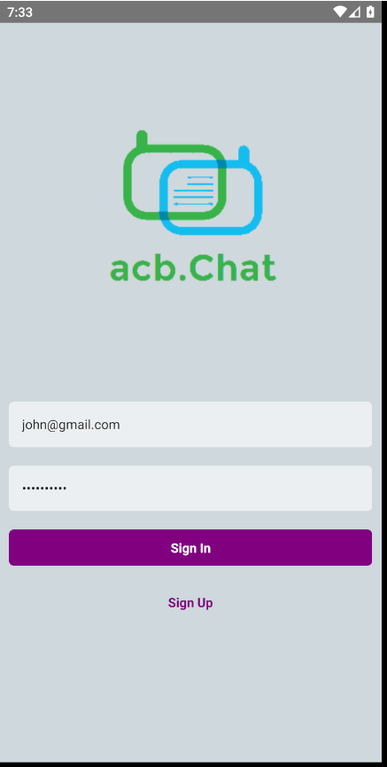
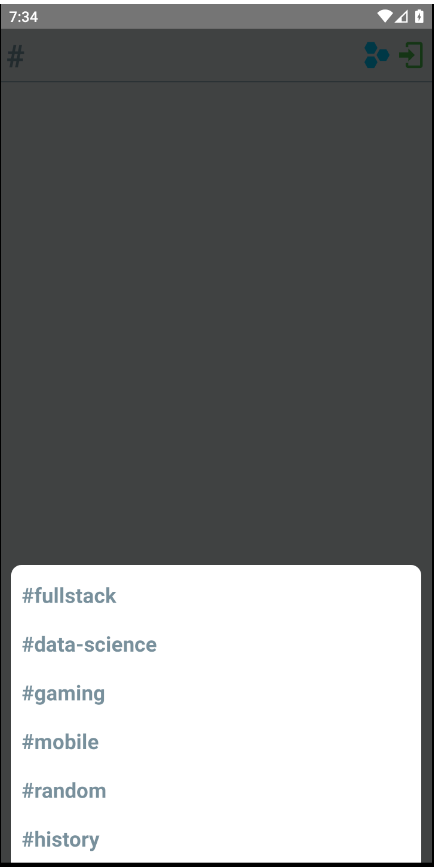

<h1 align="center">acb.Chat App (Firebase)</h1>


<div align="center">
  <h3>
    <a href="https://github.com/NureddinHasanBikec/ChatApp">
      Project Source
    </a>
  </h3>
</div>

## Table of Contents

- [Overview](#overview)
- [Built With](#built-with)
- [Features](#features)
- [How to use](#how-to-use)
- [Acknowledgements](#acknowledgements)
- [Contact](#contact)

## Overview

| Login | Sign Up     | Select Topic  |
|--------------|:--------:|:--------------------------------------------------------------:|
| || |

| John sent a message | Hernandes sent a new message     | Change Topic  |
|--------------|:--------:|:--------------------------------------------------------------:|
| || |

| Sign Out | Error Reporting    | 
|--------------|:--------:|:--------------------------------------------------------------:|
| || 


### Built With

- [React-native](https://reactnative.dev/)
- [Firebase (Authentication and Realtime Database)](https://firebase.google.com/?gclid=Cj0KCQjwufn8BRCwARIsAKzP694R8t8HoyK48GMN2tTTtGwJkIH5LIA1pMusLsuDBALEV9gZm_eyEgIaAgB0EALw_wcB)


## Features

- This Chat app is built for Android and can be adopted to IOS as well by applying settings.
- The application comprises use of :
  * React-native firebase (authentication and realtime database)
  * React stack navigation 
  * React-native modal
  * React-native vector-icons
  * Moment
  * Error reporting

- Login is the first place you will encounter when entering the application. At this point, the user enters their e-mail and password and goes to the next page. This information is checked with Firebase-authentication. 
- Predefined error codes appear as an alert when the user enters an invalid e-mail or incorrect password.
- If the user doesnt have a registered account, the user can click "Sign Up" button in Login Page and navigate to Sign Up page. Here the user fills email address and password (twice) to designated input areas. 
-After click button of Create Account, account will be created in firebase and the user navigates back to Login Page and then automatically Timeline Page. 
- Another option is that the user can click on the cancel button which makes the user navigate back to Login Page without creating an account.
- After logging in successfully, the user must choose a topic among the listed ones in the modal in order to continue. 
- Once the user selected any channel, it is possible to display the modal again and change the topic by clicking on button on top-right.
- In chat rooms the posted items show up in a chronological order with the sentding times and user names.
- The user can type a message and send to selected topic.
- The user can log out by clicking the logout icon on top-right.

## How To Use

To use this application, the packages for Navigation, Moment, Modal, Vector Icons and Firebase should be installed/identified with prior to running the app. From your command line:

```
//------FIREBASE---------------

//https://rnfirebase.io/auth/usage

//Install & setup the app module

$yarn add @react-native-firebase/app

//Install the authentication module

$yarn add @react-native-firebase/auth

//If you're developing your app using iOS, run this command

$cd ios/ && pod install && cd ..

//Install & setup the app module

$yarn add @react-native-firebase/app

//Install the database module

$yarn add @react-native-firebase/database

//If you're developing your app using iOS, run this command

$cd ios/ && pod install && cd ..

//-----REACT NAVIGATION---------

//https://reactnavigation.org/docs/getting-started

$yarn add @react-navigation/native

$yarn add react-native-reanimated react-native-gesture-handler react-native-screens react-native-safe-area-context @react-native-community/masked-view

$npx pod-install ios

//Add the following line to the top of the index.js file

@import 'react-native-gesture-handler';

$yarn add @react-navigation/stack

//-----MODAL-------------------

//https://github.com/react-native-modal/react-native-modal

$yarn add react-native-modal


//-----VECTOR ICONS-------------

//https://github.com/oblador/react-native-vector-icons

$ npm install --save react-native-vector-icons

//Detailed directions are stated in the package document. In this project only "MaterialCommunityIcons" was uploaded and used among other alternatives.

//https://oblador.github.io/react-native-vector-icons/

//-----MOMENT------------------

//https://momentjs.com/

$yarn add moment 

```
## Acknowledgements

- [Firebase(Authentication and Realtime Database)](https://firebase.google.com/?gclid=Cj0KCQjwufn8BRCwARIsAKzP694R8t8HoyK48GMN2tTTtGwJkIH5LIA1pMusLsuDBALEV9gZm_eyEgIaAgB0EALw_wcB)
- [Firebase usage](https://rnfirebase.io/)
- [Navigation](https://reactnavigation.org/docs/getting-started)
- [Modal](https://github.com/react-native-modal/react-native-modal)
- [Vector Icons - Usage](https://github.com/oblador/react-native-vector-icons)
- [Vector Icons - List](https://oblador.github.io/react-native-vector-icons/)
- [Modals](https://github.com/react-native-modal/react-native-modal)
- [Moment-js](https://momentjs.com/)

## Contact

- GitHub [NureddinHasanBikec](https://github.com/NureddinHasanBikec)
- Linkedin [@Nureddin Hasan Bikeç](https://www.linkedin.com/in/nureddin-hasan-bike%C3%A7/)

